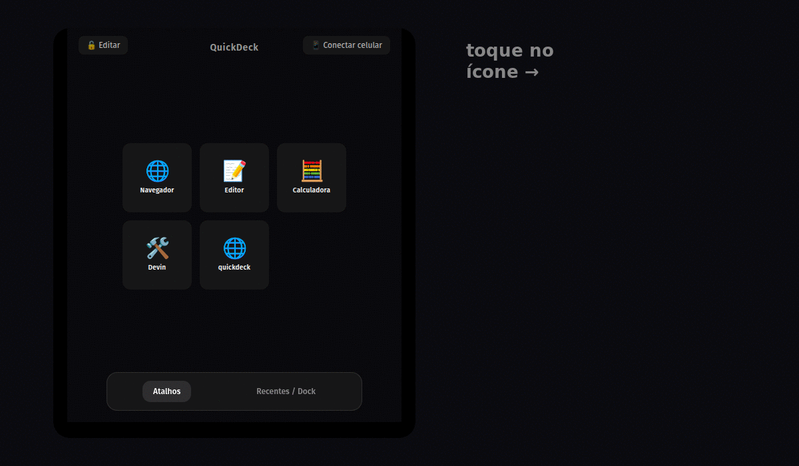
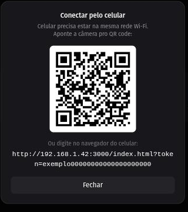
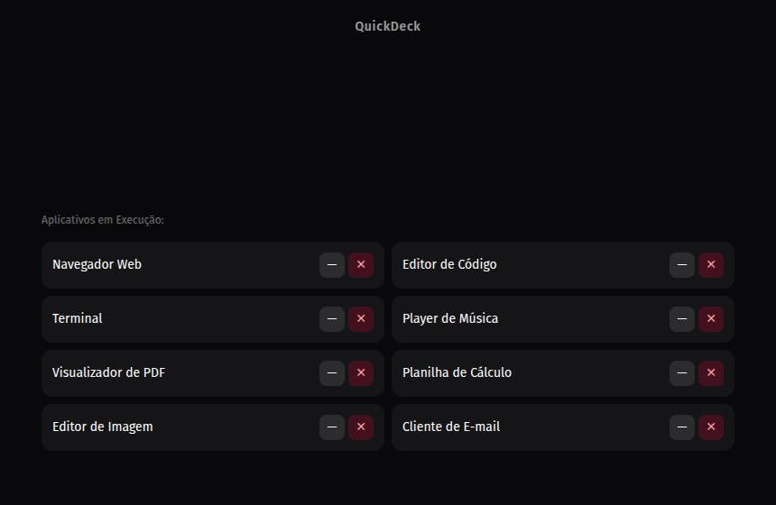

# [Projeto] QuickDeck — transformei meu celular num Stream Deck, de graça

Fala, pessoal!

Um colega me mandou um vídeo de uma pessoa mostrando o sistema de um Stream
Deck que ela tinha criado. Vi que não tinha disponibilizado o código.
Gostei da ideia e resolvi criar um do zero.

Assim nasceu o **QuickDeck**, um painel de atalhos remoto que transforma o
celular num controle pro computador — a ideia é parecida com a de um Stream
Deck físico, só que sem comprar nenhum hardware.

## Como funciona

O QuickDeck sobe um servidor na sua rede local. Você abre o app no PC,
escaneia um QR code com o celular, e pronto — os botões que aparecem na tela
do celular disparam comandos no computador. Tudo pela mesma rede Wi-Fi.

Alguns recursos que fui adicionando no caminho:

- Criar atalhos escolhendo entre os programas já instalados (ou digitando o
  comando manualmente, ou até colando um link direto)
- Sincronização em tempo real entre todos os dispositivos conectados
- Ver e controlar as janelas abertas do PC (minimizar/restaurar/fechar) pelo
  próprio celular

  
- Clique único no ícone abre um programa novo; dois cliques rápidos no mesmo
  ícone minimizam a janela dele ou trazem de volta se já estiver minimizada
  — sem precisar trocar de aba
- Layout que se adapta ao celular em pé ou deitado, com paginação estilo
  Stream Deck físico
- Modo de edição — os controles de apagar/editar ficam escondidos até você
  destravar, pra evitar toque acidental
- Emparelhamento por token, pra que apenas dispositivos autorizados pelo QR
  possam enviar comandos

## Linux em primeiro lugar (bom, quase)

Já que é pra postar aqui: o app roda em Windows, macOS e Linux. No Linux
especificamente, tem `.deb`, `.rpm`, `.AppImage`, e um `instalar.sh` que
detecta a distro sozinho e resolve as dependências (`wmctrl`/`xdotool`, só
usados pra gerenciar janelas). Testei no Pop!_OS; feedback de quem usa outra
distro é muito bem-vindo.

O app em si é feito com [Tauri](https://tauri.app/) (Rust), em vez de
Electron, justamente pra manter o cliente mais enxuto. O backend é
Node.js/Express, e a interface é HTML/JS puro com Tailwind, sem build step
nenhum.

## Onde pegar

Código aberto (MIT) aqui: **https://github.com/brunomint/quickdeck**

Pra baixar os instaladores prontos (Windows, macOS e Linux) direto:
**https://github.com/brunomint/quickdeck/releases/latest**

É um projeto bem novo e feito nas horas vagas, então esperem arestas — mas
funciona, e adoraria ouvir sugestões, bugs, ou só a opinião de vocês sobre a
ideia.

Alguém aqui já usa alguma alternativa parecida ou tem sugestão de alguma
funcionalidade que seria essencial?
